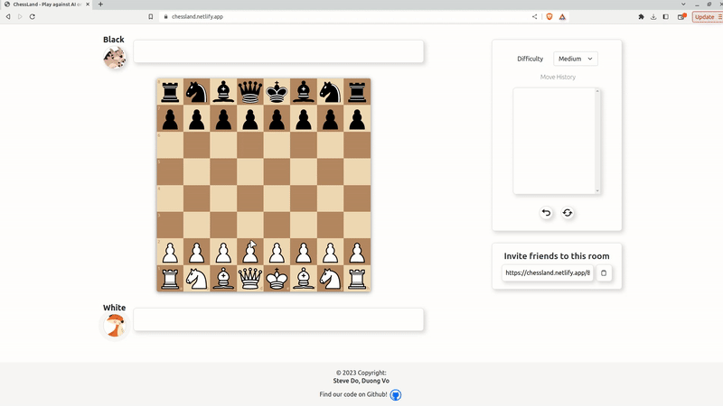
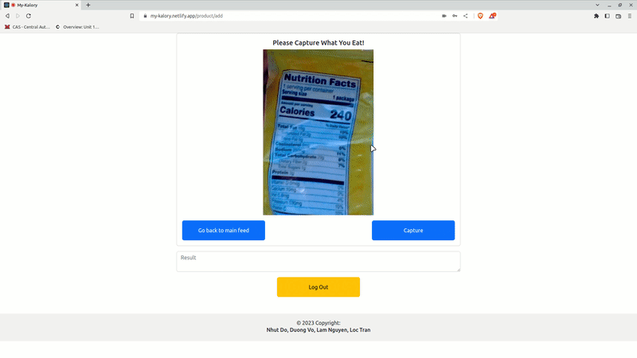
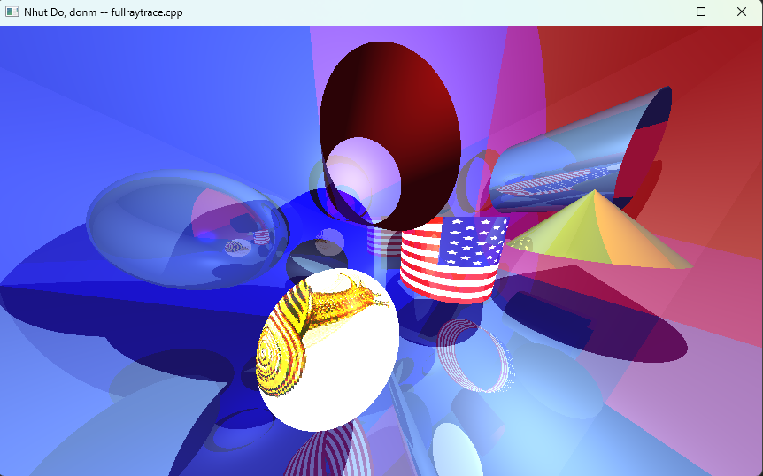
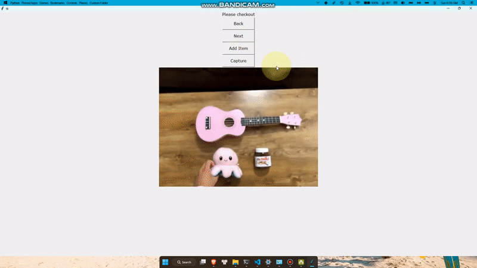
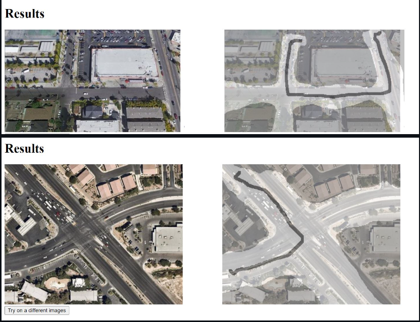

## ChessLand
An online chess platform with multiplayer games and AI opponents, including minimax search engine (optimized with alpha-beta pruning) and state-of-the-art Stockfish engine (capable of exploring billions of future possible moves).
Techstack: Node.js, Express.js, TypeScript, React.js, WebSocket, NGINX.
- 
- Tags: Category 1
- Badges:
  - Badge [blue]
- Buttons:
  - Live Demo [https://chess-land.netlify.app/]
  - GitHub [https://github.com/dominhnhut01/chessgame_webapp]

## MyKalory
A calorie tracking app that incorporates camera-based food nutrition label scanning for easy nutrient input, leveraging Google Cloud Vision API for optical character recognition and Firebase for user authentication.
Techstack: Django, React.js, PostgreSQL, Google Vision API, Firebase, NGINX.
- 
- Tags: Category 2
- Badges:
  - Badge [blue]
- Buttons:
  - Live Demo [https://my-kalory.netlify.app/]
  - GitHub [https://github.com/dominhnhut01/revolutionuc2023]

## C++ 3D Engine
A 3D engine written in C++, incorporating advanced lighting, shading techniques, and supporting keyboard navigation for immersive experiences.
Techstack: C++.
- 
- Tags: Category 3
- Badges:
  - Badge [blue]
- Buttons:
  - GitHub [https://github.com/dominhnhut01/render_engine_3D]

## Barcode-free Self-checkout System
A self-checkout kiosk app that uses camera inputs for visual product identification, featuring fine-tuned Siamese Networks for one-shot product identification.
Techstack: Python, PyTorch, Tkinter, Square Transaction API.
- 
- Tags: Category 3
- Badges:
  - Badge [blue]
- Buttons:
  - GitHub [https://github.com/duong-vo/hoya-hack]

## Road Segmentation from Satellite Images with Deep Learning
A DeepLabV3+ deep learning model segmenting roads from satellite images of New York City, achieving a 83% accuracy, and deployed it on a web application using Flask and Google Kubernetes Engine.
Techstack: Python, Tensorflow, Flask, Docker, Kubernetes.
- 
- Tags: Category 3
- Badges:
  - Badge [blue]
- Buttons:
  - GitHub [https://github.com/dominhnhut01/autodrive_code]